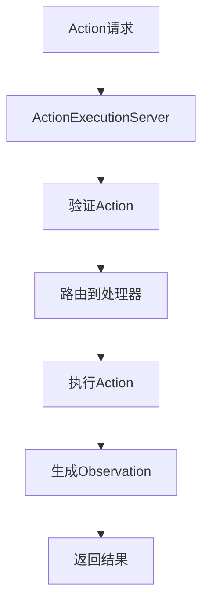
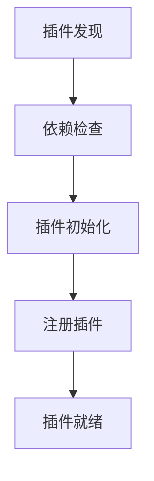

# OpenHands Runtime 完整技术栈和框架分析

## 项目概述

OpenHands Runtime是一个现代化的AI代理执行环境，采用微服务架构和容器化技术，为AI代理提供安全、可扩展、高性能的代码执行环境。

## 核心技术栈

### 1. 编程语言和框架
- **Python 3.12+**: 主要编程语言，利用最新特性
- **FastAPI**: 现代高性能Web框架，用于构建REST API
- **Uvicorn**: ASGI服务器，支持异步处理和高并发
- **AsyncIO**: 异步编程框架，提供非阻塞I/O操作
- **Pydantic**: 数据验证和序列化，确保类型安全

### 2. 容器化和云平台
- **Docker**: 主要容器化技术，提供隔离的执行环境
- **Docker API**: 容器管理和镜像构建
- **E2B**: 云端代码执行环境，提供安全的沙盒
- **Modal**: 云计算平台，支持大规模分布式计算
- **Runloop**: 云端运行环境，适合CI/CD场景
- **Daytona**: 开发环境管理平台

### 3. 浏览器自动化
- **Playwright**: 现代浏览器自动化框架（主要）
- **Selenium WebDriver**: 备用浏览器驱动，提供兼容性支持
- **Base64编码**: 图像和文件数据传输

### 4. 开发工具集成
- **Jupyter**: 交互式Python环境和notebook支持
- **IPython**: 增强的Python解释器
- **VSCode Extensions**: 代码编辑器扩展支持
- **Git**: 版本控制系统集成

### 5. 系统和网络
- **HTTPX**: 现代HTTP客户端库
- **Threading**: 多线程支持
- **Bash/Shell**: 命令行执行环境
- **TCP/IP**: 网络通信协议

### 6. 数据处理
- **NumPy**: 数值计算和数组处理
- **PIL (Pillow)**: Python图像处理库
- **JSON**: 数据序列化格式
- **YAML**: 配置文件格式

### 7. 协议和标准
- **MCP (Model Context Protocol)**: 模型上下文协议
- **REST API**: RESTful接口设计
- **WebSocket**: 实时通信协议
- **HTTP/HTTPS**: Web通信协议

## 架构模式

### 1. 设计模式
- **工厂模式**: Runtime实例创建和管理
- **抽象工厂模式**: 支持多种Runtime实现
- **构建器模式**: 复杂Runtime环境的构建
- **策略模式**: 不同执行策略的实现
- **观察者模式**: 事件驱动的通信机制
- **代理模式**: Action执行的代理和转发
- **单例模式**: 资源管理和配置管理
- **状态机模式**: Runtime生命周期管理
- **适配器模式**: 不同云平台API的适配

### 2. 架构风格
- **微服务架构**: 模块化的服务设计
- **插件架构**: 可扩展的功能模块
- **事件驱动架构**: 基于事件的异步通信
- **分层架构**: 清晰的抽象层次
- **管道过滤器**: 数据处理流水线

## 目录结构详细分析

### 根目录 (`/openhands/runtime/`)
```
├── __init__.py              # 模块入口，工厂模式管理Runtime
├── base.py                  # Runtime基类，定义核心接口
├── action_execution_server.py  # FastAPI服务器，核心执行引擎
├── file_viewer_server.py   # 文件查看服务器
├── runtime_status.py       # 状态管理，状态机模式
└── TECH_STACK_ANALYSIS.md  # 技术栈分析文档
```

### 浏览器模块 (`/browser/`)
```
├── __init__.py              # 浏览器模块入口
├── base64.py               # 图像Base64编码/解码
├── browser_env.py          # 浏览器环境管理
└── utils.py                # 浏览器操作工具
```

### 构建器模块 (`/builder/`)
```
├── __init__.py              # 构建器模块入口
├── base.py                 # 构建器基类
├── docker.py               # Docker镜像构建器
└── remote.py               # 远程构建器
```

### Runtime实现 (`/impl/`)
```
├── __init__.py              # 实现模块入口
├── action_execution/        # Action执行客户端
├── cli/                    # CLI运行时
├── daytona/                # Daytona运行时
├── docker/                 # Docker运行时（默认）
├── e2b/                    # E2B云端运行时
├── local/                  # 本地运行时
├── modal/                  # Modal云计算运行时
├── remote/                 # 远程运行时
└── runloop/                # Runloop运行时
```

### 插件系统 (`/plugins/`)
```
├── __init__.py              # 插件系统入口
├── requirement.py          # 插件依赖管理
├── agent_skills/           # AI代理技能插件
├── jupyter/                # Jupyter集成插件
└── vscode/                 # VSCode集成插件
```

### 工具函数 (`/utils/`)
```
├── __init__.py              # 工具模块入口
├── bash.py                 # Bash命令执行
├── bash_constants.py       # Bash常量定义
├── command.py              # 命令执行工具
├── edit.py                 # 文件编辑工具
├── file_viewer.py          # 文件查看器
├── files.py                # 文件操作工具
├── git_handler.py          # Git操作处理
├── log_capture.py          # 日志捕获
├── log_streamer.py         # 日志流处理
├── memory_monitor.py       # 内存监控
├── request.py              # HTTP请求工具
├── runtime_build.py        # Runtime构建工具
├── runtime_init.py         # Runtime初始化
├── singleton.py            # 单例模式实现
├── system.py               # 系统信息工具
├── system_stats.py         # 系统统计
├── tenacity_stop.py        # 重试机制
├── windows_bash.py         # Windows Bash支持
├── runtime_templates/      # Runtime模板
└── vscode-extensions/      # VSCode扩展
```

### MCP协议支持 (`/mcp/`)
```
├── config.json             # MCP配置
└── proxy/                  # MCP代理实现
```

## 核心工作流程

### 1. Runtime初始化流程
```mermaid
graph TD
    A[用户请求] --> B[get_runtime_cls()]
    B --> C[选择Runtime实现]
    C --> D[创建Runtime实例]
    D --> E[异步初始化 ainit()]
    E --> F[设置环境变量]
    F --> G[加载插件]
    G --> H[启动服务]
    H --> I[就绪状态]
```

### 2. Action执行流程


### 3. 插件加载流程


## 安全特性

### 1. 容器隔离
- **进程隔离**: Docker容器提供进程级隔离
- **文件系统隔离**: 独立的文件系统命名空间
- **网络隔离**: 受控的网络访问
- **资源限制**: CPU、内存、磁盘使用限制

### 2. 权限控制
- **最小权限原则**: 仅授予必要的权限
- **用户权限管理**: 非root用户执行
- **文件访问控制**: 限制文件系统访问范围
- **命令执行限制**: 危险命令的过滤和限制

### 3. 输入验证
- **Pydantic验证**: 严格的数据类型验证
- **路径验证**: 防止目录遍历攻击
- **命令注入防护**: 命令参数的安全处理
- **文件类型检查**: 上传文件的类型验证

### 4. 网络安全
- **HTTPS通信**: 加密的网络传输
- **API认证**: 基于Token的API访问控制
- **CORS配置**: 跨域请求的安全控制
- **速率限制**: 防止API滥用

## 性能优化

### 1. 异步处理
- **AsyncIO**: 非阻塞I/O操作
- **并发执行**: 多任务并行处理
- **连接池**: HTTP连接复用
- **异步数据库**: 非阻塞数据库操作

### 2. 缓存机制
- **内存缓存**: 热数据的内存存储
- **镜像缓存**: Docker镜像的分层缓存
- **构建缓存**: 构建过程的增量缓存
- **结果缓存**: 计算结果的缓存

### 3. 资源管理
- **内存监控**: 实时内存使用监控
- **垃圾回收**: 自动内存回收
- **连接管理**: 数据库和网络连接管理
- **资源池**: 资源的池化管理

### 4. 流式处理
- **大文件处理**: 流式文件读写
- **日志流**: 实时日志流处理
- **数据流**: 大数据的流式处理
- **响应流**: 流式HTTP响应

## 扩展性设计

### 1. 插件架构
- **动态加载**: 运行时插件加载
- **热插拔**: 无需重启的插件更新
- **依赖管理**: 插件依赖的自动解析
- **版本控制**: 插件版本兼容性管理

### 2. Runtime扩展
- **自定义Runtime**: 支持自定义Runtime实现
- **云平台适配**: 新云平台的快速集成
- **协议扩展**: 新通信协议的支持
- **API扩展**: 新API接口的添加

### 3. 配置系统
- **环境配置**: 多环境配置支持
- **动态配置**: 运行时配置更新
- **配置验证**: 配置参数的验证
- **配置继承**: 配置的层次化管理

## 监控和日志

### 1. 日志系统
- **结构化日志**: JSON格式的日志记录
- **日志级别**: 多级别日志管理
- **日志轮转**: 自动日志文件轮转
- **日志聚合**: 分布式日志收集

### 2. 监控指标
- **性能指标**: CPU、内存、网络使用率
- **业务指标**: 任务执行成功率、响应时间
- **错误监控**: 异常和错误的实时监控
- **健康检查**: 服务健康状态检查

### 3. 调试支持
- **调试模式**: 详细的调试信息输出
- **性能分析**: 代码性能分析工具
- **内存分析**: 内存使用分析
- **网络分析**: 网络请求分析

## 部署和运维

### 1. 容器化部署
- **Docker镜像**: 标准化的部署单元
- **多阶段构建**: 优化的镜像大小
- **镜像安全**: 安全扫描和漏洞检测
- **镜像仓库**: 私有镜像仓库管理

### 2. 云原生支持
- **Kubernetes**: 容器编排和管理
- **服务发现**: 自动服务发现和注册
- **负载均衡**: 流量分发和负载均衡
- **自动扩缩容**: 基于负载的自动扩缩容

### 3. CI/CD集成
- **自动构建**: 代码提交触发的自动构建
- **自动测试**: 集成测试和单元测试
- **自动部署**: 多环境的自动部署
- **回滚机制**: 快速回滚到稳定版本

## 总结

OpenHands Runtime是一个技术先进、架构合理的AI代理执行环境，具有以下特点：

1. **现代化技术栈**: 采用最新的Python特性和现代化框架
2. **微服务架构**: 模块化设计，易于维护和扩展
3. **安全可靠**: 多层次的安全防护和容器隔离
4. **高性能**: 异步处理和优化的资源管理
5. **可扩展**: 插件架构和灵活的配置系统
6. **云原生**: 支持多种云平台和容器化部署

这个技术栈设计体现了现代软件开发的最佳实践，为AI代理提供了强大、安全、可扩展的执行环境。
